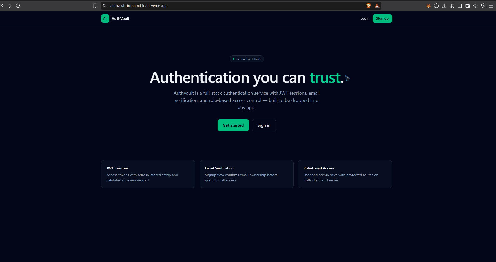
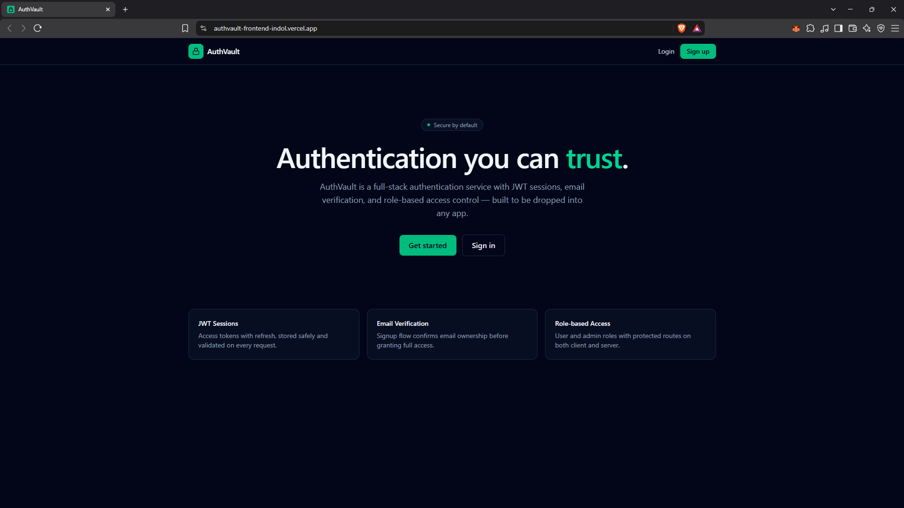
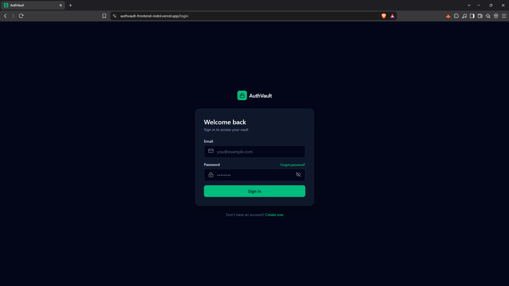
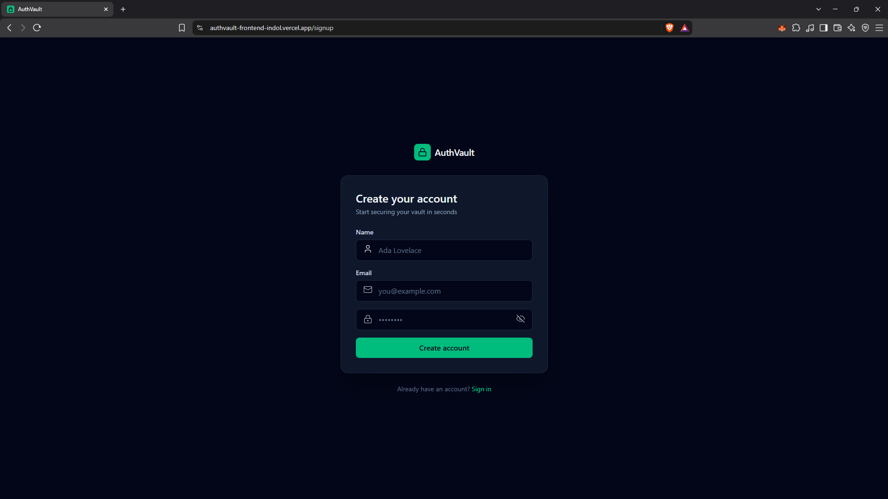
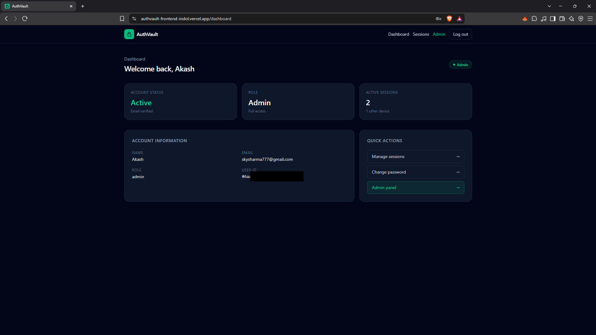
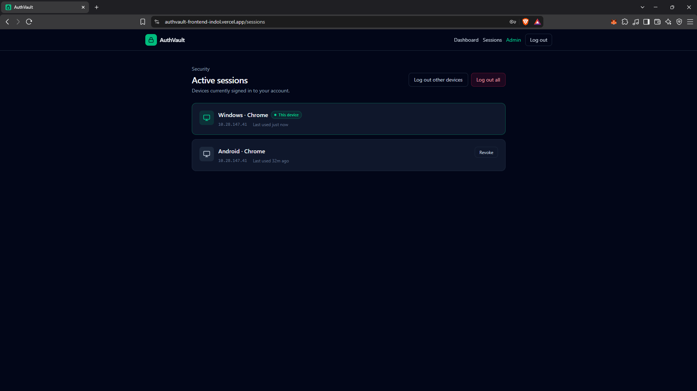
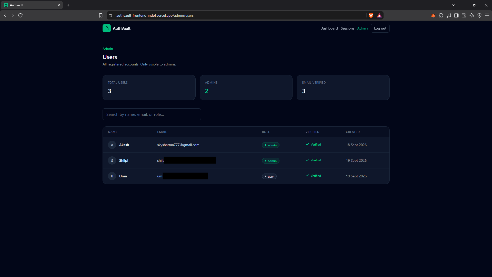

<h1>
  
  AuthVault
</h1>

A production-ready MERN authentication system focused on secure authentication, session management, email verification, password recovery, and role-based authorization.

**Live Demo:** https://authvault-frontend-indol.vercel.app/

**Backend API:** https://authvault-backend-o5me.onrender.com/

---

## Overview

AuthVault is a full-stack authentication application built with the MERN stack.

The project was designed to go beyond a basic username/password authentication flow and demonstrate how authentication can be structured in a real-world application.

It includes:

* Email verification with OTP
* Secure password hashing
* JWT access and refresh tokens
* HTTP-only authentication cookies
* Automatic access-token refresh
* Refresh-token rotation
* Server-side session tracking
* Session management and revocation
* Logout from all devices
* Logout from other devices
* Forgot-password and password-reset flows
* Password history enforcement
* CSRF protection
* Rate limiting
* Role-based authorization
* Admin user management
* Production email delivery
* MongoDB Atlas persistence
* Production deployment with Vercel and Render

---

## Features

### Authentication

* User registration
* Email verification using a six-digit OTP
* Login and logout
* Protected routes
* Current authenticated-user endpoint
* Automatic access-token refresh
* Logout from the current session
* Logout from all sessions
* Logout from other devices

### Session Management

AuthVault maintains server-side sessions for refresh-token management.

Users can:

* View active sessions
* See session metadata
* Revoke individual sessions
* Revoke other devices
* Log out from all devices

Sessions also support expiration and automatic cleanup.

### Password Management

* Forgot-password flow
* Password-reset OTP verification
* Password reset
* Change password
* Password history protection
* Reset-token expiration

### Authorization

AuthVault implements role-based access control.

Current roles:

```text
user
admin
```

Administrative functionality is protected by both authentication and role authorization.

Administrators can access the user-management interface.

### Security

Security-focused features include:

* bcrypt password hashing
* HTTP-only authentication cookies
* Secure production cookies
* SameSite cookie configuration
* CSRF protection
* Rate limiting
* Refresh-token rotation
* Refresh-token hashing in the database
* Session revocation
* Password history
* Expiring OTPs
* Expiring reset tokens
* Security headers
* Express trust-proxy configuration for production deployment
* Environment-variable based secrets

---

## Screenshots

### Login Flow



### Home Page



### Authentication





### Dashboard



### Session Management



### Admin Panel



---

## Tech Stack

### Frontend

* React
* React Router
* Axios
* Tailwind CSS
* Vite

### Backend

* Node.js
* Express
* MongoDB
* Mongoose
* JSON Web Tokens
* bcrypt
* Nodemailer

### Infrastructure

* MongoDB Atlas
* Render
* Vercel
* Brevo SMTP

---

## Architecture

AuthVault follows a separated frontend/backend architecture.

```text
                         ┌──────────────────────┐
                         │      React App       │
                         │      Vercel          │
                         └──────────┬───────────┘
                                    │
                              HTTPS / API
                                    │
                                    ▼
                         ┌──────────────────────┐
                         │    Express API       │
                         │      Render          │
                         └──────────┬───────────┘
                                    │
                    ┌───────────────┼───────────────┐
                    │               │               │
                    ▼               ▼               ▼
             ┌────────────┐  ┌────────────┐  ┌────────────┐
             │  MongoDB   │  │   Brevo    │  │   JWT /    │
             │   Atlas    │  │    SMTP    │  │   Sessions │
             └────────────┘  └────────────┘  └────────────┘
```

---

## Authentication Flow

AuthVault uses short-lived access tokens together with longer-lived refresh tokens.

```text
Login
  │
  ▼
Credentials verified
  │
  ▼
Access token + Refresh token
  │
  ├── Access token → short-lived authentication
  │
  └── Refresh token → session renewal
                         │
                         ▼
                  Session stored in DB
```

When the access token expires, the frontend can automatically request a new access token using the refresh-token flow.

Refresh-token rotation helps prevent reuse of previously rotated refresh tokens.

---

## Email Verification

During registration:

```text
User signs up
     │
     ▼
Password is securely hashed
     │
     ▼
Verification OTP generated
     │
     ▼
OTP stored with expiration
     │
     ▼
Verification email sent
     │
     ▼
User submits OTP
     │
     ▼
Email verified
```

---

## Password Reset Flow

The password recovery system uses a separate reset flow:

```text
Forgot password
      │
      ▼
Reset OTP sent
      │
      ▼
OTP verified
      │
      ▼
Reset authorization issued
      │
      ▼
New password submitted
      │
      ▼
Password updated
```

Reset tokens and OTPs are time-limited.

---

## Session Management

Each authenticated refresh-token session is represented in the database.

Session metadata includes information such as:

* User
* Refresh-token hash
* User agent
* IP address
* Last-used timestamp
* Expiration
* Revocation timestamp

This allows the application to support device/session management rather than treating authentication as a single global login state.

---

## API Routes

### Authentication

| Method | Endpoint                         | Purpose                 |
| ------ | -------------------------------- | ----------------------- |
| POST   | `/api/auth/signup`               | Create account          |
| POST   | `/api/auth/verify-email`         | Verify email            |
| POST   | `/api/auth/resend-verification`  | Resend verification OTP |
| POST   | `/api/auth/login`                | Authenticate user       |
| POST   | `/api/auth/refresh`              | Refresh access token    |
| POST   | `/api/auth/logout`               | Logout current session  |
| POST   | `/api/auth/logout-all`           | Logout all sessions     |
| POST   | `/api/auth/logout-other-devices` | Logout other sessions   |
| GET    | `/api/auth/me`                   | Get current user        |

### Password Management

| Method | Endpoint                     | Purpose                |
| ------ | ---------------------------- | ---------------------- |
| POST   | `/api/auth/forgot-password`  | Request password reset |
| POST   | `/api/auth/verify-reset-otp` | Verify reset OTP       |
| POST   | `/api/auth/reset-password`   | Reset password         |
| POST   | `/api/auth/change-password`  | Change password        |

### Sessions

| Method | Endpoint                        | Purpose              |
| ------ | ------------------------------- | -------------------- |
| GET    | `/api/auth/sessions`            | List active sessions |
| DELETE | `/api/auth/sessions/:sessionId` | Revoke a session     |

### Security

| Method | Endpoint               | Purpose           |
| ------ | ---------------------- | ----------------- |
| GET    | `/api/auth/csrf-token` | Obtain CSRF token |

### Administration

| Method | Endpoint           | Purpose    |
| ------ | ------------------ | ---------- |
| GET    | `/api/admin/users` | List users |

---

## Project Structure

```text
authvault/
│
├── backend/
│   ├── src/
│   │   ├── configs/
│   │   ├── controllers/
│   │   ├── middlewares/
│   │   ├── models/
│   │   ├── routes/
│   │   ├── services/
│   │   └── utils/
│   │
│   ├── .env.example
│   ├── load-env.js
│   ├── server.js
│   └── package.json
│
├── frontend/
│   ├── src/
│   │   ├── components/
│   │   ├── context/
│   │   ├── pages/
│   │   ├── services/
│   │   ├── App.jsx
│   │   ├── index.css
│   │   └── main.jsx
│   ├── public/
│   ├── .env.example
│   ├── vercel.json
│   ├── vite.config.js
│   └── package.json
│
├── screenshots/
├── .gitignore
└── README.md
```

---

## Getting Started

### Prerequisites

Make sure you have installed:

* Node.js
* npm
* MongoDB database
* SMTP credentials for email delivery

---

### Clone the repository

```bash
git clone https://github.com/skybreakerW/authvault.git

cd authvault
```

---

## Backend Setup

```bash
cd backend
npm install
```

Create a `.env` file based on:

```text
backend/.env.example
```

Configure the required environment variables.

Then start the development server:

```bash
npm run dev
```

The backend runs on:

```text
http://localhost:3000
```

---

## Frontend Setup

Open another terminal:

```bash
cd frontend
npm install
```

Create a `.env` file based on:

```text
frontend/.env.example
```

Set:

```env
VITE_API_URL=http://localhost:3000
```

Start the frontend:

```bash
npm run dev
```

The frontend runs on:

```text
http://localhost:5173
```

---

## Environment Variables

Sensitive credentials are intentionally excluded from the repository.

Example environment files are provided:

```text
backend/.env.example
frontend/.env.example
```

Never commit real secrets, passwords, API keys, JWT secrets, or database credentials.

---

## Production Deployment

AuthVault is deployed using:

```text
Frontend → Vercel
Backend  → Render
Database → MongoDB Atlas
Email    → Brevo SMTP
```

The production frontend communicates with the backend over HTTPS.

Production authentication cookies use secure cookie configuration suitable for cross-origin frontend/backend deployment.

---

## Security Notes

AuthVault was built with security as a major part of the project rather than treating authentication as only a login form.

The implementation includes multiple layers:

```text
Password hashing
       ↓
JWT authentication
       ↓
HTTP-only cookies
       ↓
Refresh-token rotation
       ↓
Server-side sessions
       ↓
Session revocation
       ↓
CSRF protection
       ↓
Rate limiting
       ↓
Role-based authorization
       ↓
Token / OTP expiration
```

Security testing was performed against authentication, refresh-token, session, CSRF, password-reset, and authorization flows during development.

---

## What I Learned

This project was built to deepen practical understanding of authentication architecture rather than simply implementing a basic login/register system.

Key areas explored include:

* JWT access and refresh-token architecture
* HTTP-only cookie authentication
* Refresh-token rotation
* Server-side session management
* CSRF protection
* Password-reset security
* OTP-based email verification
* Role-based authorization
* Rate limiting
* Production cookie configuration
* Cross-origin authentication
* Deployment architecture
* Authentication state management in React

---

## Future Improvements

Potential future additions include:

* OAuth / social login
* Multi-factor authentication
* Device fingerprinting improvements
* Account recovery enhancements
* More advanced administrator controls
* Automated integration testing
* CI/CD pipeline
* Expanded audit logging

---

## License

This project is currently intended as a portfolio and learning project.
